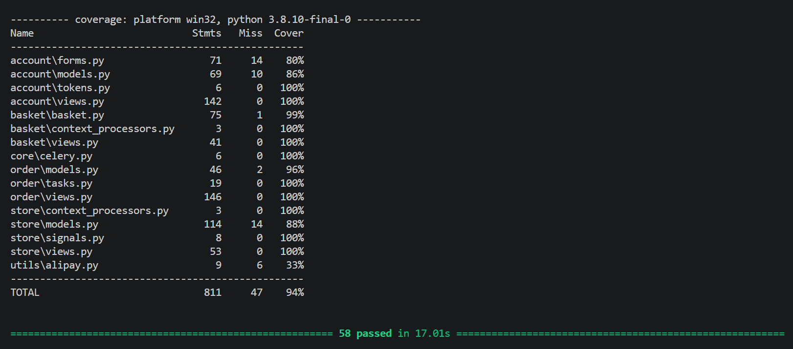
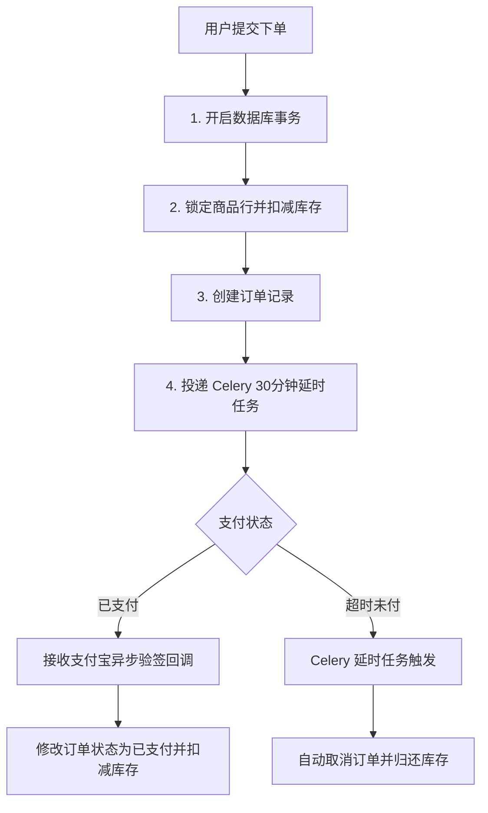

# 吃糖网  —— Django 电商平台

基于 Django + Celery + Redis 开发的 B2C 电商系统。项目采用 Django 原生模板引擎渲染，专注于后端高并发事务处理、缓存一致性设计与单元测试覆盖。

> **工程指标**：基于 pytest-django 编写完整单元测试集，整体测试覆盖率达到 **94%**（核心视图层覆盖率达 **100%**）。



---

## 核心技术亮点与工程实现

### 1. 高并发订单处理与防超卖机制

* **行级锁与数据库事务**：在订单创建逻辑中引入数据库行级锁（select_for_update）结合 @transaction.atomic 显式事务，防止多线程/多进程并发下单时的库存超卖。
* **Celery + Redis 延时任务**：引入分布式任务队列处理订单生命周期，下单成功后向 Redis 发送 30 分钟延迟取消任务；超时未支付自动取消订单并归还库存。

### 2. ORM 查询性能与缓存策略
* **消除 ORM N+1 查询**：针对多对多及外键关联查询，广泛应用 select_related（SQL 预连接）与 prefetch_related（内存拼表），将页面渲染时的数据库查询次数压减至 $O(1)$ 级别
* **公共数据缓存与动态解耦**：对首页商品列表等高频访问数据采用 Redis 数据级缓存，同时将用户个性化数据（收藏ID集合）提取到缓存外部单独注入，兼顾查询性能与数据隔离。

### 3. 安全支付与第三方接口接入
* **支付宝 SDK 接入**：基于 python-alipay-sdk 实现异步支付流转，采用 RSA2 私钥签名与公钥验签机制，确保支付回调通知的真实性与数据安全。

### 4. 高覆盖率自动化测试

* **单元测试与 Mock 机制**：使用 pytest-django 结合 pytest-mock 对核心视图函数与业务异常分支进行了 100% 覆盖，保证重构与代码迭代的稳定性。

### 5.架构优化与代码解耦

* **全局上下文处理器 (Context Processors)**：将全站多页面复用的商品分类 (Category) 逻辑抽离至 context_processors.py，实现全局模板上下文自动注入，严格遵循 DRY(Don't Repeat Yourself) 原则。
* **前端交互函数化拆分**：将购物车数量动态计算、DOM 更新等逻辑封装为模块化 JS 函数，实现“数据逻辑”与“视图渲染”清晰解耦，提升代码可维护性。

---

## 技术栈选型

* **后端框架**：Python 3.8 / Django 3.2 / Celery / Redis / MySQL
* **测试与质量**：Pytest / pytest-django / pytest-cov / pytest-mock
* **支付与工具**：python-alipay-sdk / Navicat / Git
* **前端与样式**：Django Templates / Bootstrap 5 / Native JavaScript (Fetch API / Async-Await)

---

## 核心下单与支付流程



---

## 本地开发与测试指南

```bash
1. 环境准备与数据库迁移
# 激活虚拟环境并安装依赖
pip install -r requirements.txt

# 执行数据库迁移
python manage.py migrate

2. 运行自动化测试与生成覆盖率报告
# 执行 pytest 测试集并输出详细覆盖率
pytest --cov=. --cov-report=html

3. 启动开发服务器与 Celery 异步服务
# 启动 Django 开发服务器
python manage.py runserver

# 启动 Celery Worker（另开终端）
celery -A candy_store worker -l info
```

